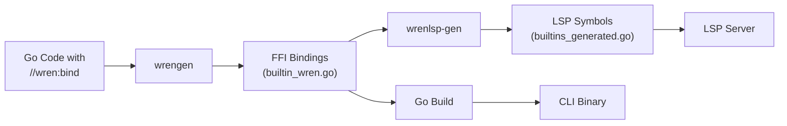

# wren.go

Go bindings for the [Wren scripting language](https://wren.io/) with advanced tooling and automation.

Wren is a small, fast, class-based concurrent scripting language designed for embedding in applications. This binding provides comprehensive Go integration with automatic code generation, CLI tools, and language server support.

## ✨ Features

### Core Features
- ✅ **Complete Wren VM** - Full Wren language support with memory management
- ✅ **Foreign Function Interface** - Seamless Go ↔ Wren integration
- ✅ **Automatic Code Generation** - Generate bindings from annotated Go code
- ✅ **Asynchronous Execution** - Built-in async/await with Future pattern
- ✅ **Thread-Safe Design** - Safe for concurrent use

### Developer Tools
- ✅ **Gwen CLI** - Interactive REPL and script runner
- ✅ **Language Server Protocol** - LSP support for editors (VS Code, Vim, etc.)
- ✅ **VS Code Extension** - Syntax highlighting and LSP integration
- ✅ **Automated Build System** - Python-based build with static linking

### Built-in Modules
- ✅ **async** - Sleep, delay, timer with Future-based execution
- ✅ **math** - Mathematical functions (sqrt, pow, sin, cos, abs, max, min, pi)
- ✅ **strings** - String manipulation (upper, lower, trim, contains, split, join, replace)
- ✅ **strconv** - Type conversion (atoi, parseFloat, itoa, formatFloat, parseBool)

## 🚀 Quick Start

### Installation

```bash
git clone --recursive https://github.com/snowmerak/wren.go.git
cd wren.go

# Build everything (C library + code generation + binaries)
python build.py all
```

### Basic Usage

```go
package main

import (
    "fmt"
    "github.com/snowmerak/wren.go"
)

func main() {
    vm := wrengo.NewVM()
    defer vm.Free()
    
    code := `System.print("Hello from Wren!")`
    result, err := vm.Interpret("main", code)
    
    if err != nil {
        fmt.Println("Error:", err)
        return
    }
    
    if result == wrengo.ResultSuccess {
        fmt.Println("Success!")
    }
}
```

### Using the CLI

```bash
# Interactive REPL
./bin/gwen

# Run a script
./bin/gwen run script.wren

# Evaluate code
./bin/gwen eval "System.print(42)"
```

### With Built-in Modules

```wren
// Math operations
System.print(Math.sqrt(16))        // 4
System.print(Math.pow(2, 8))       // 256
System.print(Math.sin(Math.pi))    // 0

// String manipulation
System.print(Strings.upper("hello"))           // HELLO
System.print(Strings.split("a,b,c", ","))      // [a, b, c]
System.print(Strings.join(["Hello", "World"], " ")) // Hello World

// Type conversion
System.print(StrConv.atoi("42"))              // 42
System.print(StrConv.formatFloat(3.14159, 2)) // 3.14
System.print(StrConv.parseBool("true"))       // true

// Async operations (returns future IDs)
var sleepId = Async.sleep(1.0)     // Sleep for 1 second
var delayId = Async.delay(500)     // Delay for 500ms
var timerId = Async.timer(2.0, "done") // Timer with message
```

## 🔧 Code Generation

Automatically generate Wren bindings from annotated Go code using `wrengen`:

### 1. Annotate Go Functions

```go
//go:generate go run github.com/snowmerak/wren.go/cmd/wrengen -dir .

// Define a module
//wren:bind module=calculator
type Calculator struct{}

// Static method
//wren:bind name=add(_,_) static
func (c *Calculator) Add(a, b float64) float64 {
    return a + b
}

// Instance method
//wren:bind name=multiply(_,_)
func (c *Calculator) Multiply(a, b float64) float64 {
    return a * b
}

// Function with different module and class
//wren:bind module=utils class=StringHelper name=reverse(_) static
func ReverseString(s string) string {
    runes := []rune(s)
    for i, j := 0, len(runes)-1; i < j; i, j = i+1, j-1 {
        runes[i], runes[j] = runes[j], runes[i]
    }
    return string(runes)
}
```

### 2. Generate Bindings

```bash
# Manual generation
go generate

# Or use build system (includes generation)
python build.py generate
```

### 3. Use in Wren

```wren
// calculator module
class Calculator {
  foreign static add(a, b)
  foreign multiply(a, b)
}

var calc = Calculator.new()
System.print(Calculator.add(5, 3))   // 8
System.print(calc.multiply(4, 7))    // 28

// utils module
import "utils" for StringHelper
System.print(StringHelper.reverse("hello")) // olleh
```

### Supported Annotations

| Annotation | Effect | Example |
|------------|--------|---------|
| `//wren:bind` | Basic binding | Creates foreign method |
| `//wren:bind module=X` | Set module name | `//wren:bind module=game` |
| `//wren:bind class=Y` | Override class name | `//wren:bind class=Physics` |
| `//wren:bind name=Z` | Override method name | `//wren:bind name=concat(_,_)` |
| `//wren:bind static` | Static method | No instance needed |

## 🛠️ Build System

Python-based build system with automatic code generation:

```bash
# Build everything (recommended)
python build.py all

# Build individual components
python build.py wren      # C library only
python build.py generate  # Code generation only
python build.py cli       # Gwen CLI only
python build.py lsp       # LSP server only

# Development
python build.py test      # Run tests
python build.py clean     # Clean artifacts
```

### Build Output

```
bin/
├── gwen(.exe)         # CLI with REPL and script runner
├── gwen-lsp(.exe)     # Language Server Protocol server
└── *.dll              # MinGW DLLs (Windows only)
```

### Platform Support

- ✅ **Linux**: Full static linking (single binary)
- ✅ **Windows**: Dynamic linking + MinGW DLLs (auto-copied)
- ✅ **macOS**: Dynamic linking (system limitation)

## 📝 Language Server Protocol (LSP)

Full LSP support for modern editors:

### Features
- ✅ **Autocompletion** - Keywords, built-in classes, custom foreign methods
- ✅ **Hover Information** - Documentation for methods and classes
- ✅ **Syntax Diagnostics** - Real-time error detection
- ✅ **Multi-file Support** - Workspace-aware symbol resolution

### VS Code Integration

Install the included VS Code extension:

```bash
cd vscode-extension
npm install
npm run compile
# Install in VS Code: Ctrl+Shift+P → "Install from VSIX"
```

Or configure manually in `.vscode/settings.json`:

```json
{
  "gwen.lsp.serverPath": "path/to/gwen-lsp",
  "gwen.cli.path": "path/to/gwen"
}
```

### Vim/Neovim Integration

```lua
require'lspconfig'.configs.gwen = {
  default_config = {
    cmd = {'path/to/gwen-lsp'},
    filetypes = {'wren', 'gwen'},
    root_dir = function(fname)
      return vim.fn.getcwd()
    end,
  },
}

require'lspconfig'.gwen.setup{}
```

### Built-in Symbol Support

The LSP automatically includes symbols for:

**Core Wren Classes:**
- `System` - print, write, clock, gc
- `Fiber` - new, yield, call
- `List` - add, clear, count, insert, removeAt
- `Map` - clear, containsKey, count, keys, values, remove
- `String` - contains, count, startsWith, endsWith
- `Num` - abs, ceil, floor, isNaN, toString

**Built-in Modules (auto-generated):**
- `Async` - sleep, delay, timer
- `Math` - sqrt, pow, sin, cos, abs, max, min, pi
- `Strings` - upper, lower, trim, contains, split, join, replace
- `StrConv` - atoi, parseFloat, itoa, formatFloat, parseBool

## 🏗️ Architecture

### Component Overview

```
wren.go/
├── 📁 builtin/          # Built-in modules (async, math, strings, strconv)
├── 📁 cmd/
│   ├── 📁 gwen/         # CLI application (renamed from wren-std)
│   ├── 📁 gwen-lsp/     # LSP server (renamed from wren-lsp-std)
│   ├── 📁 wrengen/      # Code generator
│   └── 📁 wrenlsp-gen/  # LSP symbol generator
├── 📁 wrenlsp/          # LSP library
├── 📁 vscode-extension/ # VS Code extension
├── 📁 example/          # Complete examples
└── 📁 deps/wren/        # Wren C library (submodule)
```

### Code Generation Flow



### VM and Foreign Method System

- **Global Registry**: Foreign methods registered once globally
- **Per-VM Execution**: Each VM has independent execution context
- **Thread-Safe**: Mutex-protected operations
- **Automatic Cleanup**: Memory management with defer patterns

## 📚 API Reference

### VM Management

```go
// Basic VM
vm := wrengo.NewVM()
defer vm.Free()

// VM with configuration
config := wrengo.DefaultConfiguration()
config.InitialHeapSize = 5 * 1024 * 1024 // 5MB
vm := wrengo.NewVMWithConfig(config)
defer vm.Free()

// VM with foreign methods
vm := wrengo.NewVMWithForeign()
defer vm.Free()
```

### Script Execution

```go
// Interpret code
result, err := vm.Interpret("module_name", source_code)

// Check results
switch result {
case wrengo.ResultSuccess:
    // Success
case wrengo.ResultCompileError:
    // Syntax error
case wrengo.ResultRuntimeError:
    // Runtime error
}
```

### Configuration Options

```go
type Configuration struct {
    InitialHeapSize   int  // Initial heap size (default: 10MB)
    MinHeapSize       int  // Minimum heap size (default: 1MB)
    HeapGrowthPercent int  // Growth percentage (default: 50)
}
```

### Foreign Method Registration

```go
// Register manually
wrengo.RegisterForeignMethod("module", "Class", true, "method(_)", callback)

// Or use code generation
//wren:bind module=mymodule
type MyClass struct{}

//wren:bind name=myMethod(_) static
func (m *MyClass) MyMethod(arg string) string {
    return "Hello, " + arg
}
```

## 🧪 Testing and Examples

### Run Examples

```bash
# Complete feature demonstration
go run example/main.go

# Individual examples
cd example
go generate  # Regenerate bindings
go run .
```

### Run Tests

```bash
# All tests
python build.py test

# Individual packages
go test ./wrenlsp -v
go test -v
```

### Example Output

The example program demonstrates 20+ features including:
- Basic Wren language features
- Foreign function integration
- Multi-module usage
- Multiple VM instances
- Async task execution

## 🔧 Development

### Project Structure

```bash
# Core library
go build .

# CLI tool
go build ./cmd/gwen

# LSP server
go build ./cmd/gwen-lsp

# Code generator
go build ./cmd/wrengen
```

### Adding New Built-in Modules

1. Create `builtin/newmodule.go`:

```go
package builtin

//wren:bind module=newmodule
type NewModule struct{}

//wren:bind name=function(_) static
func (n *NewModule) Function(arg string) string {
    return "Result: " + arg
}
```

2. Regenerate code:

```bash
python build.py generate
```

3. Use in Wren:

```wren
System.print(NewModule.function("test"))  // Result: test
```

### Supported Go Types

| Go Type | Wren Type | Notes |
|---------|-----------|-------|
| `int`, `int32`, `int64` | Number | Converted via float64 |
| `float32`, `float64` | Number | Direct mapping |
| `string` | String | UTF-8 encoding |
| `bool` | Bool | true/false |
| `error` (return) | Abort | Fiber aborts on error |

### Error Handling

Functions returning `(value, error)` automatically handle errors:

```go
//wren:bind name=divide(_,_) static
func Divide(a, b float64) (float64, error) {
    if b == 0 {
        return 0, errors.New("division by zero")
    }
    return a / b, nil
}
```

## 🤝 Contributing

Contributions welcome! Areas for improvement:

1. **More Built-in Modules** - JSON, HTTP, file I/O, etc.
2. **LSP Enhancements** - Go to definition, formatting, workspace symbols
3. **VS Code Extension** - Better syntax highlighting, debugging support
4. **Documentation** - More examples and tutorials
5. **Testing** - Expanded test coverage

### Development Setup

```bash
git clone --recursive https://github.com/snowmerak/wren.go.git
cd wren.go
python build.py all
go test ./...
```

## 📄 License

MIT License - see [LICENSE](LICENSE) for details.

## 🙏 Credits

- [Wren Programming Language](https://wren.io/) by Bob Nystrom
- This Go binding and tooling by [snowmerak](https://github.com/snowmerak)

## 🔗 Links

- [Wren Language Documentation](https://wren.io/)
- [Language Server Protocol Specification](https://microsoft.github.io/language-server-protocol/)
- [Go CGO Documentation](https://pkg.go.dev/cmd/cgo)

---

**Made with ❤️ for embedding Wren in Go applications**
